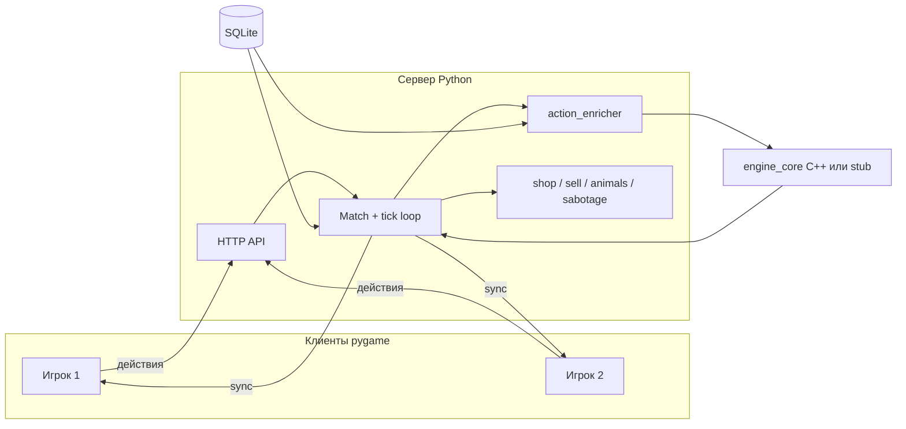

# Farm Wars

Мультиплеерная 2D-ферма на Windows: выращиваешь культуры, кормишь животных, печёшь на заводах и опережаешь соперников. Сервер — единственный источник правды; клиент только показывает картину и отправляет действия.

Если нужна «карта местности» по коду — ты в правильном файле: ниже и игра, и архитектура, и как всё запустить за пять минут.

---

## Содержание

1. [Суть игры](#суть-игры)
2. [Как устроен матч](#как-устроен-матч)
3. [Семена и урожай](#семена-и-урожай)
4. [Архитектура](#архитектура)
5. [Структура репозитория](#структура-репозитория)
6. [Быстрый старт](#быстрый-старт)
7. [Играть: управление и LAN](#играть-управление-и-lan)
8. [HTTP API](#http-api)
9. [Тесты](#тесты)
10. [Документация и процесс команды](#документация-и-процесс-команды)
11. [Что дальше](#что-дальше)

---

## Суть игры

Ты ведёшь ферму на сетке **6 грядок + 2 загона**. Соперники (до трёх человек) делают то же на своих участках карты.

**Цель матча** — первым получить в инвентарь заданный продукт (по умолчанию **хлеб**). Его готовят на пекарне из муки и пшеницы.

Параллельно можно:

- покупать семена и корм в магазине;
- продавать собранный урожай за **бестики** (внутриигровая валюта);
- применять **саботаж** по клеткам соперника (если игроков больше одного);
- переживать **случайные события** (засуха, дождь и т.д.).

Полная продуктовая задумка — в [`GAME.md`](GAME.md). Технический scope MVP — в [`GAME_TECH_REQUIREMENTS.md`](GAME_TECH_REQUIREMENTS.md).

---

## Как устроен матч

Время в игре идёт **тиками**. Сервер раз в ~0,25 с (4 тика/сек) собирает очередь действий игроков, обогащает их данными из SQLite и один раз вызывает движок `simulate_tick`. Результат — новое состояние мира и список событий; клиенты подтягивают его через HTTP.



**Два типа действий:**

| Тип | Примеры | Где обрабатывается |
|-----|---------|-------------------|
| Немедленные | покупка, продажа, животное, саботаж | только сервер, без тика движка |
| На тик | полив, посадка, сбор, рецепт, корм | сервер обогащает → движок |

Победа проверяется после тика: есть ли у игрока целевой продукт в инвентаре → событие `MATCH_FINISHED`.

---

## Семена и урожай

В инвентаре два разных слоя предметов — это важно не путать.

| В инвентаре | Пример | Зачем |
|-------------|--------|--------|
| **Семена** (`SEED`) | `wheat_seed` | посадка на грядку; покупка в магазине |
| **Урожай и товары** (`RAW` / `PROCESSED`) | `wheat`, `milk`, `bread` | сбор с грядки, рецепты, **продажа** |

При посадке клиент шлёт `plant_id: "wheat"`. Сервер добавляет `seed_product_id` и `crop_product_id`; движок **списывает один пакет семян** и ставит на клетку культуру `wheat`. При сборе в инвентарь попадает уже **пшеница**, не семена.

Стартовый набор (на игрока): семена нескольких культур, немного муки и корма, **120 бестиков** — см. `server/world_factory.py`.

---

## Архитектура

| Слой | Технология | Кто ведёт |
|------|------------|-----------|
| Клиент (основной) | **Svelte 5 + TS + Vite** (`web/`) | NIKITA |
| Клиент (legacy) | Python + pygame (`client/`) | NIKITA |
| Сервер, API, матч, БД | Python + SQLite | NIKITA |
| Симуляция тика | C++ (`pybind11`) + зеркальный stub | SANYA |
| Контракты v1 | `docs/contracts/GAME_CONTRACTS_V1.md` | NIKITA_LEAD + команда |

**Принципы:**

- **Contract-first** — форматы `TickInput`, действий и событий зафиксированы до кода соседнего модуля.
- **Server-authoritative** — клиент не считает игру сам, только отображает `world_state` с сервера.
- **Stub ≡ C++** — без собранного модуля работает `engine_core_stub`; поведение должно совпадать (`tools/smoke_test.py`).

Границы модулей подробно: [`docs/contracts/ARCHITECTURE_V1.md`](docs/contracts/ARCHITECTURE_V1.md).

---

## Структура репозитория

```
farm-wars/
├── web/                 # браузерный клиент (Svelte + Vite) — основной UI
├── client/              # pygame (legacy до parity)
├── server/              # HTTP API, матчи, enricher, магазин, события
├── db/                  # schema.sql, seed_minimal.sql, загрузчик каталога
├── engine_cpp/          # C++ simulate_tick + сборка .pyd
├── engine_core_stub/    # Python-заглушка движка (dev / CI без C++)
├── shared/              # pacing, пути к движку, зеркало контрактов
├── fixtures/            # эталонные world_state и actions для тестов
├── tools/               # init_db, build_engine, автотесты
└── docs/
    ├── contracts/       # GAME_CONTRACTS_V1, ARCHITECTURE_V1
    └── specs/           # ТЗ по задачам (NIKITA / SANYA / gameplay)
```

**Полезные точки входа в код:**

| Задача | Файл |
|--------|------|
| Запуск сервера | `server/__main__.py` |
| Тик матча | `server/match.py` |
| Обогащение посадки/рецепта | `server/action_enricher.py` |
| Магазин / продажа | `server/shop.py`, `server/sell.py` |
| Создание мира | `server/world_factory.py` |
| Веб-клиент | `web/src/App.svelte`, `web/src/lib/actions/gameActions.ts` |
| Клиент pygame | `client/main.py`, `client/ui.py` |
| Движок | `engine_cpp/src/simulate_tick.cpp`, `engine_core_stub/stub.py` |
| Контент | `db/seed_minimal.sql` |

---

## Быстрый старт (exe / один клик)

Сборка portable-версии (Python + Node нужны **только на машине сборки**):

```bash
bash build-release.sh
```

или в Windows: двойной клик `build-release.bat` / `powershell -File scripts/build-release.ps1`

Играть из папки `release/out/dist/FarmWars/` → **`Play-FarmWars.bat`**.  
Подробности: [`RELEASE.md`](RELEASE.md).

Из исходников без exe: `bash play.sh` или `play.bat`.

---

## Быстрый старт (разработка)

### Требования

- Windows 10+
- Python 3.11+
- Для C++-движка: CMake + MSVC **или** MinGW (см. ниже)

### 1. Зависимости и база

```bash
pip install -r client/requirements.txt
pip install pybind11
py tools/init_db.py --seed
```

Команда создаёт `db/farm_wars.db` из схемы и сида. **После `git pull`**, если менялись `schema.sql` или `seed_minimal.sql`, пересоздайте БД той же командой.

### 2. Движок (рекомендуется)

Без сборки сервер использует **stub** — для разработки UI/сервера этого достаточно. Для полного совпадения с продакшен-логикой:

```bash
py tools/build_engine.py
```

| Ситуация | Команда |
|----------|---------|
| Visual Studio (python.org) | `py tools/build_engine.py --toolchain msvc` |
| MinGW / MSYS2 | `py tools/build_engine.py --toolchain gcc` |
| Чистая пересборка | `py tools/build_engine.py --clean` |

> На Windows перед сборкой **закройте** `py -m server` и все клиенты — иначе файл `engine_core*.pyd` может быть заблокирован.

Артефакт: `engine_cpp/build/engine_core.cp311-win_amd64.pyd` (имя может отличаться по версии Python).

### 3. Сервер

```bash
py -m server
```

По умолчанию: `http://0.0.0.0:8765`. В логе будет LAN-IP для гостей.

### 4. Клиент (браузер — основной, в разработке)

```bash
cd web
npm install
npm run dev
```

Откройте http://localhost:5173 — API в dev проксируется на `:8765` (сервер должен быть запущен).

ТЗ миграции: [`docs/specs/client/002.NIKITA.WEB_CLIENT_SVELTE_VITE.md`](docs/specs/client/002.NIKITA.WEB_CLIENT_SVELTE_VITE.md)  
**Документация фронтенда:** [`docs/frontend/README.md`](docs/frontend/README.md) (архитектура, структура, sync, UI, dev)

LAN без proxy: создайте `web/.env.local` с `VITE_API_BASE=http://192.168.x.x:8765` (нужен CORS на сервере — уже включён).

### 4b. Клиент pygame (legacy, до parity)

```bash
py -m client
```

В лобби: **Server IP** → **Connect** → создать матч или войти по коду → хост нажимает **Start**.

Гость в LAN:

```bash
py -m client --host 192.168.x.x --port 8765
```

---

## Играть: управление и LAN

### Экран матча

- **Слева** — твоя ферма (6 грядок, 2 загона), подсказка по выбранной клетке.
- **Справа** — панель «Ферма и склад»: цель, действия, урожай, семена, магазин, рецепты, животные, заводы.
- **Снизу** (если есть соперники) — ферма выбранного противника и саботаж.

### Клавиши

| Клавиша | Действие |
|---------|----------|
| **W** | полить выбранную грядку |
| **T** | посадить выбранные семена |
| **H** | собрать урожай |
| **B** | запустить выбранный рецепт на заводе |
| **C** | купить выбранное животное в загон |
| **F** | покормить животное в загоне |
| **V** | продать товар (лучше сначала кликнуть чип урожая справа) |
| **1–6** | выбор культуры для посадки |
| **X** | саботаж по **чужой** клетке |
| **Esc** | выход в лобби |

### Мультиплеер 2–4 игрока

| Роль | Шаги |
|------|------|
| **Хост** | `py -m server` → Create → дождаться гостей → Start → передать **код комнаты** и **IP из лога** |
| **Гость** | Server IP = IP хоста → Connect → Join → ждать старт (клиент сам войдёт в матч) |

На хосте откройте порт **8765** в брандмауэре Windows для Python.

Сценарий приёмки: [`docs/specs/gameplay/001.SIGNOFF_DEMO_SCRIPT.md`](docs/specs/gameplay/001.SIGNOFF_DEMO_SCRIPT.md).

### Темп и баланс

- **4 тика в секунду** (`FARM_WARS_TICK_SEC=0.25`).
- Поля `growth_time_sec`, `production_time_sec` в БД — это **тики**, не секунды стенного времени. Перевод: тики ÷ 4 ≈ секунды.
- Случайные события: по умолчанию проверка каждые **120** тиков (~30 с), шанс **20%**.

### Переменные окружения

| Переменная | Сторона | По умолчанию | Назначение |
|------------|---------|--------------|------------|
| `FARM_WARS_HOST` | сервер | `0.0.0.0` | bind |
| `FARM_WARS_PORT` | оба | `8765` | порт |
| `FARM_WARS_TICK_SEC` | сервер | `0.25` | интервал тика |
| `FARM_WARS_SERVER_HOST` | клиент | `127.0.0.1` | IP сервера |
| `FARM_WARS_WIN_PRODUCT` | сервер | `bread` | цель победы |
| `FARM_WARS_DEV` | сервер | — | `1` → цель `cake` (длинный тест) |
| `FARM_WARS_EVENT_INTERVAL` | сервер | `120` | период проверки событий |
| `FARM_WARS_EVENT_PROB` | сервер | `0.2` | вероятность события |
| `FARM_WARS_DB_PATH` | сервер | `db/farm_wars.db` | путь к БД |

---

## HTTP API

Базовый URL: `http://<host>:8765`

| Метод | Путь | Назначение |
|-------|------|------------|
| GET | `/api/health` | статус, версия shop handler, каталог для UI |
| POST | `/api/matches/create` | создать матч |
| POST | `/api/matches/join` | `{ "join_code", "player_name" }` |
| POST | `/api/matches/start` | `{ "match_id" }` |
| POST | `/api/matches/action` | конверт `ClientActionEnvelope` |
| GET | `/api/matches/{id}/sync?since_tick=N` | состояние + события |
| GET | `/api/matches/{id}/roster` | список игроков в лобби |

Форматы полей — [`docs/contracts/GAME_CONTRACTS_V1.md`](docs/contracts/GAME_CONTRACTS_V1.md).

---

## Тесты

Запускайте из корня репозитория:

```bash
py tools/verify_seed.py          # минимумы контента в БД
py tools/test_db_pricing.py      # формулы цен рецептов
py tools/smoke_test.py           # движок: контракт, stub vs C++
py tools/test_server_flow.py     # сервер: магазин, посадка, победа
py tools/test_multiplayer.py     # 2–4 игрока, sync, саботаж, owner
py tools/test_vertical_slice.py  # 2 игрока, bread, poison_water
```

`tools/test_client_net.py` — нужен **запущенный** сервер.

Удобная проверка перед коммитом, затрагивающим движок или БД:

```bash
py tools/init_db.py --seed
py tools/build_engine.py
py tools/smoke_test.py
py tools/test_server_flow.py
py tools/test_multiplayer.py
```

---

## Документация и процесс команды

| Документ | Зачем читать |
|----------|----------------|
| [`GAME.md`](GAME.md) | идея игры, фантазия продукта |
| [`GAME_TECH_REQUIREMENTS.md`](GAME_TECH_REQUIREMENTS.md) | полный тех scope, DoD, roadmap |
| [`docs/contracts/GAME_CONTRACTS_V1.md`](docs/contracts/GAME_CONTRACTS_V1.md) | протокол действий и событий |
| [`TASK_STATUS.md`](TASK_STATUS.md) | статусы ТЗ и team checkpoints |
| [`DECISIONS.md`](DECISIONS.md) | почему приняли те или иные решения |
| [`AGENTS.md`](AGENTS.md) | правила для ИИ-агентов |
| [`docs/frontend/README.md`](docs/frontend/README.md) | веб-клиент: архитектура, модули, sync, разработка |
| [`docs/specs/gameplay/010.TEAM.WORK_SUMMARY_AND_HANDOFF.md`](docs/specs/gameplay/010.TEAM.WORK_SUMMARY_AND_HANDOFF.md) | что уже сделано и handoff |

**ТЗ по ролям (актуальный backlog):**

- SANYA — [`docs/specs/engine_cpp/006.SANYA.NEXT_ENGINE_ROADMAP.md`](docs/specs/engine_cpp/006.SANYA.NEXT_ENGINE_ROADMAP.md)
- NIKITA — [`docs/specs/server/010.NIKITA.NEXT_SERVER_CLIENT_ROADMAP.md`](docs/specs/server/010.NIKITA.NEXT_SERVER_CLIENT_ROADMAP.md)

Именование файлов ТЗ: `NNN.DEVELOPER.TITLE.md` в `docs/specs/...` (см. [`TZ_REQUIREMENTS.md`](TZ_REQUIREMENTS.md)).

---

## Что дальше

| Статус | Тема |
|--------|------|
| Готово | MVP-цикл фермы, MP 2–4, семена/урожай, магазин, продажа, животные, события, саботаж |
| Готово (движок) | `player_id` в ошибках, `START_RECIPE` только на свой завод (`engine_cpp/006` P0) |
| В работе | Ручной LAN sign-off 3–4 клиента (`gameplay/009`) |
| План | Контрмеры, одиночный режим, UI polish (`server/010`) |
| План | Больше контента (~10 растений по `GAME_TECH_REQUIREMENTS.md`) |

| Критерий MVP | Сейчас |
|--------------|--------|
| Клиент + сервер на Windows | да |
| Матч 2–4 по коду (LAN) | да |
| Победа по целевому продукту | да |
| Контент из SQLite | да (6 культур, 4 животных, 8 рецептов) |
| Контрмеры в игре | в планах |
| Одиночный режим | в планах |

---

## Команда

- **NIKITA_LEAD** — архитектура, контракты, приёмка
- **NIKITA** — client, server, db, интеграция
- **SANYA** — C++ `engine_core`, stub, smoke-тесты движка

Лицензия — см. [`LICENSE`](LICENSE).
