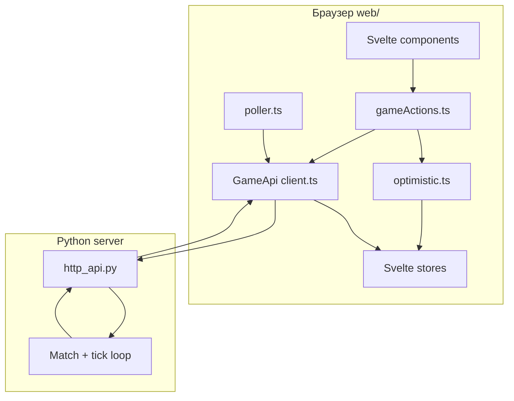

# Архитектура веб-клиента

## Роль клиента

Веб-клиент — **тонкий presentation layer**:

- отображает `world_state` с сервера;
- отправляет `PlayerAction` через `POST /api/matches/action`;
- не считает итог тика и не дублирует серверную бизнес-логику.

Единственный источник правды — **сервер** (`server/match.py`, enricher, движок). Клиент может **оптимистично** подправить UI до ответа, но всегда сходится с `sync` из ответа или фонового poll.

## Слои

| Слой | Путь | Ответственность |
|------|------|-----------------|
| Entry | `src/main.ts`, `App.svelte` | Монтирование, переключение lobby / match |
| Components | `src/components/` | Разметка, события UI, без прямых `fetch` |
| Actions | `src/lib/actions/` | Сценарии игрока: care, plant, sell, sabotage… |
| Sync | `src/lib/sync/` | Poll, `applySync`, optimistic reconcile |
| API | `src/lib/api/` | HTTP, типы контракта v1 |
| Game logic (read-only) | `src/lib/game/` | Хелперы: тайлы, инвентарь, лейблы, визуал |
| Stores | `src/lib/stores/` | Реактивное состояние сессии и матча |
| Match lifecycle | `src/lib/match/` | Вход/выход из матча, старт хоста |

**Правило зависимостей:** `components` → `actions` / `stores` / `game`; не импортировать компоненты из `$lib`.

## Экраны приложения

`App.svelte` смотрит на store `screen` (`session.ts`):

| Значение | Компонент | Когда |
|----------|-----------|--------|
| `lobby` | `LobbyPanel` | До матча: connect, create/join, roster, start |
| `match` | `MatchView` | После `enterMatch()` — ферма, склад, PvP |

Переходы — только через `lib/match/lifecycle.ts` (`enterMatch`, `leaveMatch`, `hostStartMatch`).

## Контракт с сервером

Типы в `lib/api/types.ts` зеркалят [`GAME_CONTRACTS_V1.md`](../contracts/GAME_CONTRACTS_V1.md):

- `WorldState`, `TileState`, `PlayerState`
- `PlayerAction` + `ActionEnvelope`
- `SyncResponse` (`world_state`, `tick_id`, `events`)
- `ActionSubmitResponse` — `{ accepted, sync? }` (после действия сразу приходит актуальный sync)

Каталог UI (`products`, `recipes`, `animals`, `sabotages`) — из `GET /api/health` → store `catalog`.

## Оптимистичный UI

Цель — **отзывчивость** без ложной уверенности:

1. `gameActions.sendAction` клонирует мир и применяет `applyOptimisticAction` (best-effort).
2. `submitAction` → если есть `res.sync`, вызывается `applySync` (перезапись сервером).
3. При ошибке или отсутствии sync — `requestSync()`.
4. Фоновый `poller` каждые `SYNC_POLL_MS` (120 ms) подтягивает расхождения.

Оптимистика **не обязана** покрывать все edge cases (саботаж, события мира) — серверный sync исправляет.

## Что клиент не делает

- не вызывает `simulate_tick` / движок;
- не хранит очередь тиковых действий (сервер ставит в очередь матча);
- не валидирует владельца клетки для PvP (только UX-подсказки; отказ — `SABOTAGE_FAILED` и т.д.);
- не читает SQLite напрямую.

## Parity с pygame

При добавлении механики сверяйтесь с:

- `client/ui.py`, `client/match_screen.py` — раскладка и хоткеи;
- `client/net.py` — те же endpoints.

Целевое ТЗ parity: [`docs/specs/client/002.NIKITA.WEB_CLIENT_SVELTE_VITE.md`](../specs/client/002.NIKITA.WEB_CLIENT_SVELTE_VITE.md).
