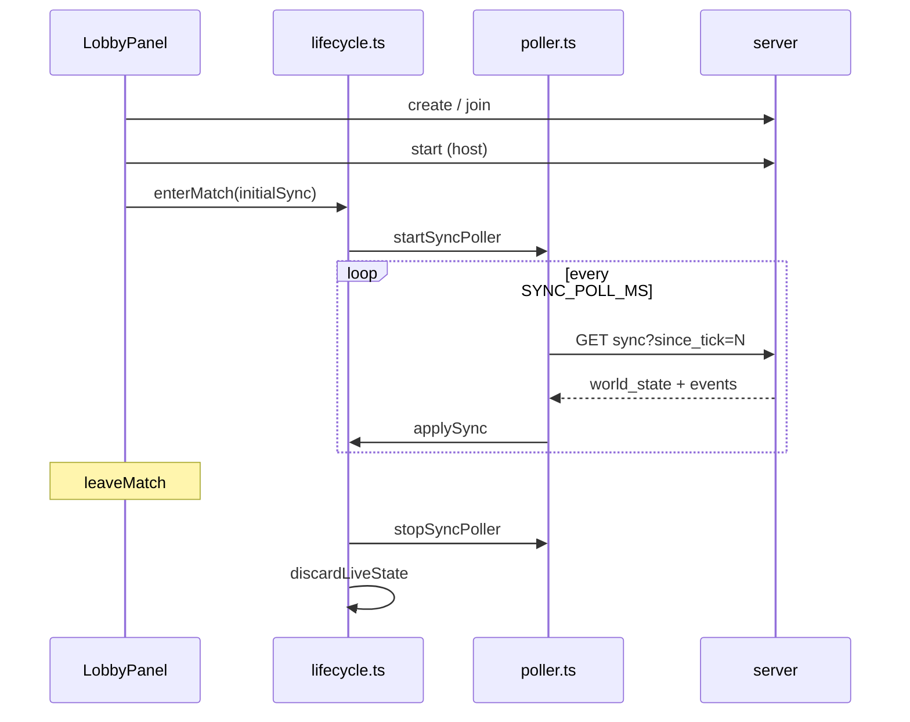

# Состояние и синхронизация

## Жизненный цикл матча



### `enterMatch(initial?: SyncResponse)`

1. `syncEnabled = true`
2. если передан `initial` — `applySync(initial)`
3. `screen = "match"`
4. `startSyncPoller()`
5. сброс выбора тайла / соперника, дефолт `selectedPlantId`

Вызывается:

- хостом после `hostStartMatch` (start + первый sync);
- гостем, когда poll roster видит `status === "running"` (см. `LobbyPanel`).

### `leaveMatch()`

1. `stopSyncPoller()`
2. `discardLiveState()` — обнулить мир, события, `matchFinished`
3. `screen = "lobby"`

## Stores: что где хранить

| Данные | Store | Обновляет |
|--------|-------|-----------|
| ID матча / игрока | `session` | лобби после create/join |
| Каталог продуктов | `session.catalog` | `GET /api/health` |
| Снимок мира | `game.worldState` | `applySync`, optimistic |
| Номер тика (для since_tick) | `game.lastTick` | `applySync` |
| Выбранная клетка | `game.selectedTileId` | клик по `FarmGrid`, контекстное меню |
| Флаг конца матча | `game.matchFinished` | событие `MATCH_FINISHED` |
| Разрешён ли poll | `game.syncEnabled` | lifecycle |

**Не дублируйте** `world_state` в локальном `$state` компонентов — читайте `$worldState` из store или `$derived` от него.

## Poll sync

`lib/sync/poller.ts`:

- интервал: `SYNC_POLL_MS` = **120 ms** (`lib/game/constants.ts`);
- каждый тик вызывает `requestSync()` если есть `matchId` и `syncEnabled`.

`requestSync()`:

```ts
api.pollSync(matchId, get(lastTick))
```

Параметр `since_tick` — сервер отдаёт дельту событий; полный `world_state` приходит в ответе.

Фоновый poll **дополняет**, а не заменяет sync в ответе на action: после `submitAction` сразу вызывается `applySync(res.sync)`.

## `applySync(sync)`

Порядок:

1. если `!syncEnabled` — выход (защита после leave);
2. `worldState.set(sync.world_state)`;
3. `lastTick` ← `sync.tick_id`;
4. разбор `events`: победа, тосты;
5. `feedToasts(events, playerId)` — см. `events.ts`.

## Оптимистичные обновления

`sendAction` в `gameActions.ts`:

```ts
const optimistic = applyOptimisticAction(world, pid, catalog, action);
if (optimistic) worldState.set(optimistic);
const res = await api.submitAction(...);
if (res.sync) applySync(res.sync);
else await requestSync();
```

`optimistic.ts` покрывает (best-effort):

- покупка / продажа (деньги, инвентарь);
- полив / корм (списание B, вода, флаги);
- посадка (семена, occupant на тайле);
- сбор, рецепт, животное;
- часть саботажа (вода, флаги).

**Не покрывает** или упрощает: случайные события мира, отказы сервера, чужие действия. Любое расхождение снимает следующий `applySync`.

Стоимости ухода в optimistic зеркалят `server/care_costs.py` (feed price из каталога, вода = feed−1).

## Лобби: отдельные интервалы

| Константа | Значение | Где |
|-----------|----------|-----|
| `LOBBY_POLL_MS` | 350 ms | roster в комнате |
| `LOBBY_HEALTH_POLL_MS` | 4000 ms | `GET /api/health`, статус сервера |

Не путать с `SYNC_POLL_MS` — health poll работает только на экране лобби.

## События и тосты

`lib/game/events.ts`:

- `humanizeEvent` — текст для лога/тоста;
- `shouldSkipEvent` — чужие ошибки, чужой stipend, скрытый саботаж;
- `feedToasts` — дедуп по `tick_id + event_type + payload hash`.

При добавлении нового `event_type` с сервера обновите все три функции, иначе игрок не увидит feedback.

## Ошибки сети

- `ApiError` из `client.ts` → toast + `statusMessage` в session;
- после ошибки action — `requestSync()` для отката optimistic.

## Отладка рассинхрона

1. DevTools → Network: частота `/sync`, тело `world_state.tick_id`.
2. Сравнить баланс B и инвентарь до/после action в ответе `submitAction`.
3. Временно увеличить `SYNC_POLL_MS` не рекомендуется для prod UX; для отладки можно локально.

## Связь с сервером

Сервер после queued action может сразу вызвать `process_tick` и вернуть свежий `sync` в теле action — клиент должен **всегда** предпочитать `res.sync` над только optimistic.

См. `server/game_server.py`, `GameServer.submit_action`.
